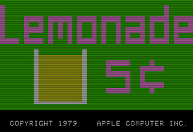

# Lemonade Stand

A project that will eventually be a browser-based, over-powered Azure uprade of the beloved 1979 game, from back in the Apple II days. You may also be familiar with it from C-64/128 or various DOS ports. I played it first on the Commodore 64 and it's one of the first games I think we had. Nostalgia for ya.

## Goals

 - Convert the game to a browser-based application
 - Explore browser, drawing library and new-ish cloud technologies 
 - Develop a retro, 8-bit look and feel for the UI, but make it pop hehehe
 - Over-engineer the heck out of this because why not
 - Perhaps introduce high scoring systems, 5-day weather forecasts, some other elements (like choose a neighborhood)
 - Create a competitive "season" for a world-wide simultaneous multiplayer 
 - Have some fun, learn some stuff, don't take it too seriously, work away at it as I have time

## Tech Stack

I have lived in the dotnet world and will continue to do so. I'll be running this as an Azure project and updating this list as I go.

 - dotnet 6
 - Azure Functions
 - (maybe?) Vue.JS
 - (likely?) SignalR
 
## Project Needs

I'm not the best at design. I think that it would be fun to explore some drawing libraries to help render the game in combination with a lightweight framework, but I am open to suggestions here and would love to find someone willing or wanting to collaborate on some graphics or rendering code.

## Contributing

If you have a great idea that you'd like to see incorporated, please feel free to create a proposal as an issue and we can talk through it. Then, just fork the code and put together a pull request.

 
